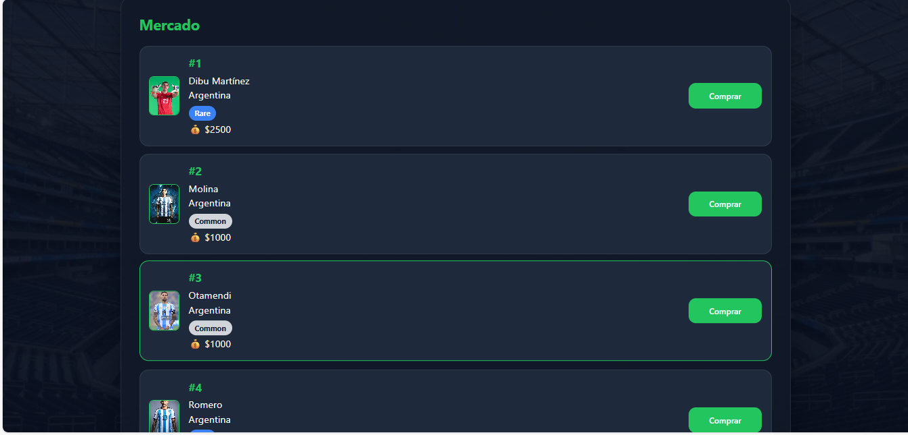
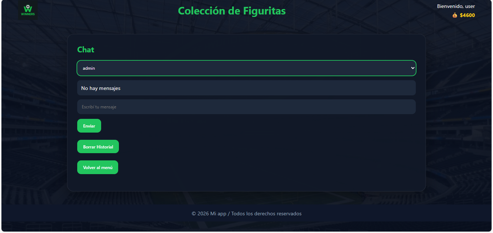

# 📚 Colección de Figuritas

Aplicación web desarrollada como proyecto de tesis para la gestión de una colección de figuritas. El sistema permite a los usuarios registrarse, iniciar sesión, administrar su colección personal, intercambiar figuritas mediante un mercado y comunicarse a través de un chat.

## 🚀 Tecnologías utilizadas

### Frontend
- HTML5
- CSS3
- JavaScript

### Backend
- Node.js
- Express.js

### Base de datos
- SQLite3

## 📂 Estructura del proyecto

```
proyecto-coleccion-Figuritas/
│
├── frontend/
│   ├── css/
│   ├── js/
│   ├── views/
│   └── assets/
│
├── backend/
│   ├── controllers/
│   ├── models/
│   ├── routes/
│   ├── database/
│   └── server.js
│
└── README.md
```

## ✨ Funcionalidades

- Registro e inicio de sesión de usuarios.
- Gestión de la colección de figuritas.
- Visualización de la colección personal.
- Mercado para intercambio de figuritas.
- Chat entre usuarios.
- Persistencia de datos mediante SQLite.
- Arquitectura basada en el patrón MVC.

## ⚙️ Instalación

### Clonar el repositorio

```bash
git clone https://github.com/davidpaz0208-ux/coleccion-de-figuritas.git
```

### Ingresar al proyecto

```bash
cd coleccion-de-figuritas
```

### Instalar dependencias del backend

```bash
cd backend
npm install
```

### Ejecutar el servidor

```bash
node server.js
```

Luego abrir el frontend desde el navegador o mediante un servidor local, según la configuración del proyecto.

## 🧠 Arquitectura

El proyecto sigue el patrón **Modelo - Vista - Controlador (MVC)**:

- **Modelos:** acceso a la base de datos.
- **Controladores:** lógica de negocio.
- **Rutas:** manejo de las peticiones HTTP.
- **Vistas:** interfaz de usuario.

## 📸 Capturas

Se recomienda agregar imágenes de:

- Inicio de sesión.
- Pantalla principal.
- Colección de figuritas.
- Mercado.
- Chat.

## 📸 Capturas de pantalla

### Inicio de sesión


### Pantalla principal


### Mi colección


### Mercado



### Chat



## 👨‍💻 Autor

**David Alejandro Paz**

Proyecto desarrollado como trabajo final de la carrera.
